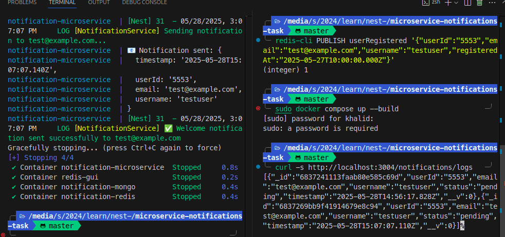

# Notification Microservice - Docker Setup

This microservice handles user notifications via Redis Pub/Sub and stores them in MongoDB.

## 🐳 Docker Configuration

### Services

- **notification-service**: NestJS microservice (Port 3001)
- **redis**: Redis for pub/sub messaging (Port 6379)
- **mongo**: MongoDB for notification storage (Port 27017)
- **redis-commander**: Redis GUI (Port 8081)

## 🚀 Quick Start

### Development Mode

```bash
#use docker-compose directly
docker-compose up --build
```

### 1. Publish Events via Redis

```bash
# Test userRegistered event
docker exec -it notification-redis redis-cli PUBLISH userRegistered '{"userId":"123","email":"test@example.com","username":"testuser"}'

#or add sudo before the command
```

### 2. HTTP Endpoints

```bash

# Get notification logs
curl http://localhost:3001/notifications/logs
```

### 3. Management UIs

- **Redis Commander**: http://localhost:8081

### MongoDB Collections

- `notifications`: Stores all notification records

### Fields

- `userId`: For user-specific queries
- `email`: For email lookups
- `status`: For filtering by status
- `userName`: For notification type filtering
- `timestamp`: For time-based sorting

## 🔄 Development Workflow


### Development with Hot Reload

```bash
# Start development environment
docker-compose up

# The application will reload automatically when you change files
```
